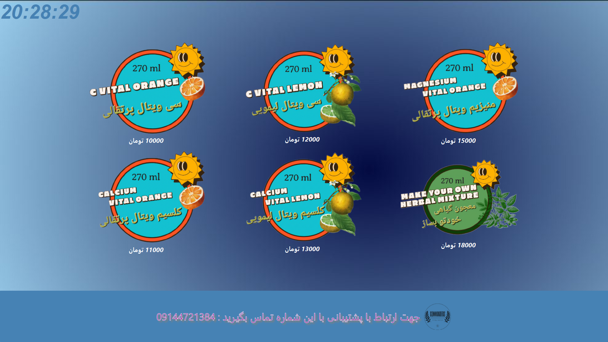
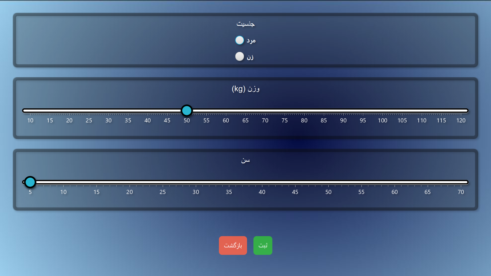

# 🧃 Vital Vending Machine System

A Java-based GUI application for an intelligent vending machine that provides customized vitamin-enriched and herbal-infused water using user input. Built entirely in pure Java with JavaFX, without Scene Builder.

---

## ✨ Features

- 🎨 **Custom UI** built with JavaFX (no FXML, no Scene Builder).
- 💅 CSS-based styling for all interface components.
- 🔄 Multiple panels/pages including:
  - Welcome/Idle Screen
  - User Input Screen (age, gender, weight)
  - Custom Drink Recommendation Screen
  - QR Code Generation Page
  - Payment Screen
  - Admin Panel
- 🧠 Uses user data to generate a **personalized drink recipe**.
- 🤖 Integrated with **Arduino hardware** for real-time control.
- 📺 Fullscreen kiosk mode – cannot be closed unless the correct admin password is entered.
- 🧭 Smooth animated transitions between pages.

---

## 🛠 Technologies Used

- Java 17+
- JavaFX
- CSS for styling
- Arduino communication libraries

---

## 🚀 Getting Started

### Prerequisites

- Java Development Kit (JDK) 17 or higher
- JavaFX SDK
- Arduino (optional, for hardware integration)

### Run the App

1. Clone the repository:
   ```bash
   git clone https://github.com/einmensch1847/Vital-Vending-Machine-System-.git
   cd Vital-Vending-Machine-System-
## 📸 Screenshots

### Main Interface


### User Info Page

